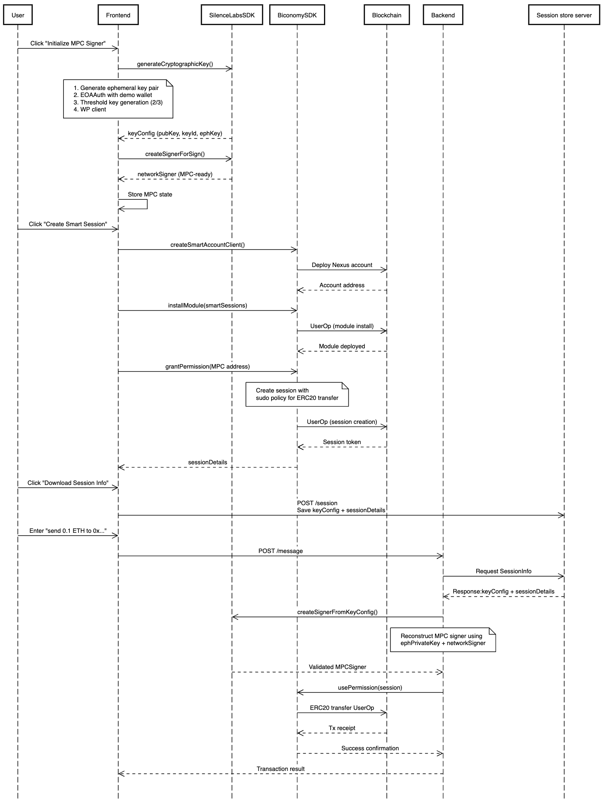

### MPC Session Demo

## Overview

This demo showcases a secure wallet implementation using Multi-Party Computation (MPC) and Smart Sessions. It demonstrates how to:

1. Create a cryptographic MPC signer using Silence Labs SDK
2. Set up a Smart Session using Biconomy's AbstractJS
4. Execute transactions through natural language commands

## Architecture

The application consists of:

- **Frontend**: React application with TypeScript and Tailwind CSS
- **Backend**: Eliza OS agent that processes commands and executes transactions
- **Blockchain**: Interacts with Base Sepolia testnet through Biconomy's infrastructure

## Sequence Diagram



## How It Works

### 1. MPC Signer Initialization
The process starts with initializing an MPC signer, which uses thresholded distributed key generation to create a session signer. This signer is responsible for signing transactions without exposing the real private key.

### 2. Smart Session Creation
• Creates a Nexus account via MetaMask sign-in.
• Pops up the fund-me address for 60 s → you deposit 0.002 ETH.
• Installs Smart-Session module & signs a permission granting the MPC signer transfer() rights on the demo ERC-20 token.

### 3. Upload Session Data
Front-end bundles everything (sessionDetails, keyConfig, etc.) into one object called sessionInfo and POSTs it to
POST /api/session with the header x-user-id: <stable-UUID-per-keyId>.

### 4. Natural Language Transaction Execution
Users can send simple commands like "send 0.1 ETH to 0xABC..." to initiate transactions. The Eliza OS backend parses these commands, reconstructs the MPC signer, and executes the transaction using the pre-authorized session.

## Security Features

- **Limited Permissions**: Smart Sessions restrict what transactions the session can execute.
- **Time-Limited Access**: Sessions can be configured to expire after a certain time.
- **Threshold Cryptography**: Uses 2-of-3 MPC for enhanced security.

## Getting Started

### Prerequisites

- Node.js v16+
- Access to Base Sepolia testnet
- A wallet with Base Sepolia ETH for gas

### Setup

1. Clone this repository
2. Install dependencies:
   ```
   npm install
   ```
3. Start the development server:
   ```
   npm run dev
   ```
4. Ensure the backend Eliza OS agent is running and configured properly(link to ElizaOS github repo here [Link](https://github.com/silence-laboratories/elizaSl/tree/bicoxsl ))


### Usage Flow

1. Click "Initialize MPC Signer" to set up the cryptographic infrastructure
2. Click "Create Smart Session" to establish session permissions
3. Click "upload session info" to upload the session data to the backend
4. Click "Fund me" to deposit of atleast 0.002 ETH into the session account
5. Follow "proceed to chat" to chat window
6. chat window will open, where you can enter commands like "send 0.1 ETH to 0xABC..."
7. The Eliza OS backend will process the command, reconstruct the MPC

## Technical Stack

- **Frontend**: React, TypeScript, Tailwind CSS
- **Blockchain Integration**: 
  - Biconomy AbstractJS for Smart Accounts and Smart Sessions
  - Viem for blockchain interactions
- **Cryptography**: Silence Labs SDK for MPC key generation and signing
- **Backend**: Eliza OS agent for command processing
- **Session-store-backend**: Store session data and key configurations

## Important Notes

- This is a demo application
- Uses Base Sepolia testnet for all blockchain interactions

## Resources

- [Biconomy AbstractJS Documentation](https://docs.biconomy.io/docs/category/abstractjs)
- [Viem Documentation](https://viem.sh/)
- [Base Sepolia Testnet](https://docs.base.org/guides/build-with-base/network-information/)
- [For more details check SL documentation](https://docs.silencelaboratories.com/silent-shard-network-mpc-tss-avs/6qFeKkGD4YVu6YYlr0pQ/start-here/the-network-functionality/a-session-key-experience-with-account-abstraction-and-silent-network) 

